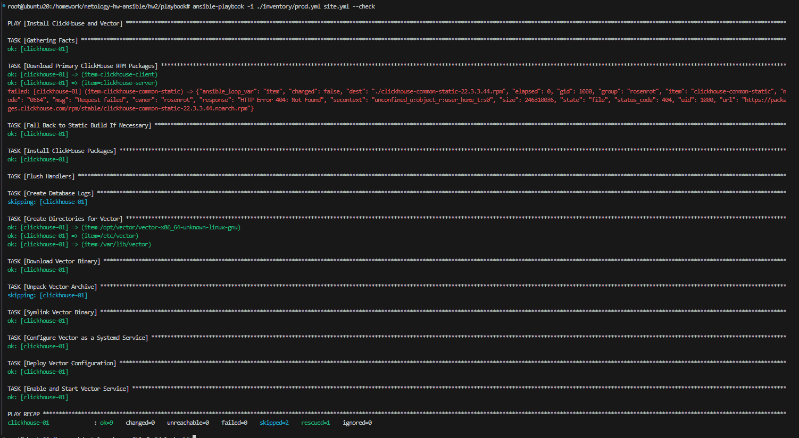

Инструкция

Плейбук для установки clickhouse и vector на сервер с подключением по ssh

Зависимости
ansible 2.15.13
OS Centos7

Конфиг файлы
./group_vars/clickhouse/vars.yml Конфигурация установки clickhouse
./group_vars/vector/vars.yml Конфигурация установки vector

Запуск
1. Прописываем параметры подключения ./inventory/prod.yml
2. Запускаем ansible-playbook -i ./inventory/prod.yml site.yml